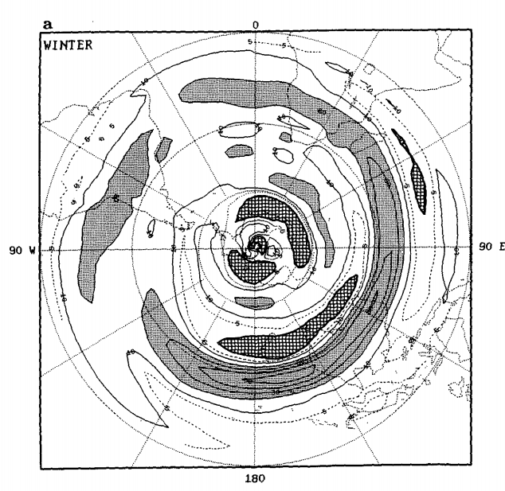

```{r setup, include=FALSE}
library(tufte)
# invalidate cache when the tufte version changes

knitr::opts_chunk$set(
    echo = FALSE,
    message = FALSE,
    warning = FALSE,
    cache = TRUE,
    cache.path = "cache/septiembre/")
setwd("/home/elio/Documents/Tesis/")
library(ncdf4)
source("scripts/helperfun.R")
library(meteoR)
library(scales)
month.abb <- c("Ene", "Feb", "Mar", "Abr", "May", "Jun",
               "Jul", "Ago", "Sep", "Oct", "Nov", "Dic")
names(month.abb) <- as.character(1:12)
theme_elio <- theme_minimal() +
    theme(legend.position = "bottom")
theme_set(theme_elio)

map.world.3 <- BuildMap(res = 3, smooth = 3, pm = 180)
map.SH.3 <- geom_map2(map.world.3[lat %b% c(-90, 20)])
map.world.3 <- geom_map2(map.world.3)
map.SH.countries <- geom_map2(BuildMap(countries = T, res = 8))
interp.levs <- exp(seq(log(925), log(30), length.out = 40))
d2r <- pi/180
```

# Análisis de septiembre | The September of my Years

## Climatología.


```{r}
# # Valores diarios
# # Temperatura diaria en 850
# ncep.d <- ReadNetCDF("DATA/NCEP/air.daily.mean.nc")
# ncep.d <- ncep.d[, month := month(date[1]), by = date] %>%
#     .[month == 9] %>%
#     .[, month := NULL]
# 
# # Viento meridional diario en 850
# ncep_d.v850 <- ReadNetCDF("DATA/NCEP/vwnd850.daily.mean.nc")
# ncep_d.v850 <- ncep_d.v850[, month := month(date[1]), by = date] %>%
#     .[month == 9] %>%
#     .[, month := NULL] %>%
#     .[year(date) < 2016]
# 
# joinvars = c("lon", "lat", "level", "date")
# ncep.d <- ncep.d[ncep_d.v850, on = joinvars]
# remove(ncep_d.v850)
# 
# # v't'
# ncep.vt <- ncep.d[, .(vt = cov(air, vwnd)), by = .(lon, lat, level, year(date))]
# 
# remove(ncep.d)
# 
# # Viento zonal diario en 300
# ncep_d.u <- ReadNetCDF("DATA/NCEP/uwnd300.daily.mean.nc")
# ncep_d.u <- ncep_d.u[, month := month(date[1]), by = date] %>%
#     .[month == 9] %>%
#     .[, month := NULL]
# 
# # Viento meridional diario en 300
# ncep_d.v <- ReadNetCDF("DATA/NCEP/vwnd300.daily.mean.nc")
# ncep_d.v <- ncep_d.v[, month := month(date[1]), by = date] %>%
#     .[month == 9] %>%
#     .[, month := NULL]
# 
# ncep_d.u[ , vwnd := ncep_d.v$vwnd]
# 
# # v'u'
# # ncep.vu <- ncep_d.u[, c("u.t", "v.t") := .(Anomaly(uwnd), Anomaly(vwnd)), by = .(lon, lat, level)][
# #     , .(vu = mean(u.t*v.t)), by = .(lon, lat, level, year(date))]
# ncep.vu <- ncep_d.u[, .(vu = cov(uwnd, vwnd)), by = .(lon, lat, level, year(date))]
# 
# remove(ncep_d.u, ncep_d.v)
# 
# 
# # Valores mensuales
# low <- as.Date("1984-12-31")
# high <- as.Date("2016-01-01")
# # Geopotencial mensual en todos los niveles
# ncep <- ReadNetCDF("DATA/NCEP/hgt.mon.mean.nc")[date > low & date < high]
# ncep <- ncep[month(date) == 9]
# 
# # Temperatura mensual en todos los niveles
# ncep.air <- ReadNetCDF("DATA/NCEP/air.mon.mean.nc")[date > low & date < high]
# ncep.air <- ncep.air[month(date) == 9]
# ncep <- ncep.air[ncep, on = joinvars]
# 
# # Presión a nivel del mar
# ncep.slp <- ReadNetCDF("DATA/NCEP/slp.mon.mean.nc")[month(date) == 9][, level := 1000]
# ncep <- ncep.slp[ncep, on = joinvars]
# remove(ncep.slp)
# # OLR
# ncep.olr <- ReadNetCDF("DATA/NCEP/olr.mon.mean_sub.nc")[month(date) == 9][, level := 10]
# ncep <- ncep.olr[ncep, on = joinvars]
# remove(ncep.olr)
# 
# # Vientos
# ncep.u <- ReadNetCDF("DATA/NCEP/uwnd.mon.mean.nc")
# ncep.u <- ncep.u[, month := month(date[1]), by = date][
#                  month == 9][
#                  , month := NULL][
#                  year(date) > 1984 & year(date) < 2016]
# 
# ncep.v <- ReadNetCDF("DATA/NCEP/vwnd.mon.mean.nc")
# ncep.v <- ncep.v[, month := month(date[1]), by = date][
#                  month == 9][
#                  , month := NULL][
#                  year(date) > 1984 & year(date) < 2016]
# 
# ncep[, c("u", "v" ) := .(ncep.u$uwnd, ncep.v$vwnd)]
# ncep[, year := year(date[1]), by = date][
#     , date := NULL]
# ncep[level == 300, vu := ncep.vu$vu]
# ncep[level == 850, vt := ncep.vt$vt]
# 
# setnames(ncep, c("level", "hgt"), c("lev", "gh"))
# a <- 6371000
# omega <- 2*pi/(24*3600)
# ncep[, v.dx := Derivate(v, lon*pi/180)/(a*cos(lat*pi/180)), by = .(lat, lev, year)][
#      , u.dy := Derivate(u, lat*pi/180, bc = "none")/a, by = .(lon, lev, year)][
#      , zeta := v.dx - u.dy][
#      , eta  := 2*omega*sin(lat*pi/180) + zeta][
#      , c("v.dx", "u.dy") := NULL]
# 
# saveRDS(ncep, "DATA/NCEP/ncep.september.Rds")
# remove(ncep.slp, ncep.olr, ncep.u, ncep.v, ncep.t, ncep.vu, ncep.vt)
```

```{r}
ncep <- readRDS("DATA/NCEP/ncep.september.Rds")
# La PP queda en otro data.table porque tiene otra grilla (más fina)
ncep.pp <- ReadNetCDF("DATA/NCEP/pprate.mon.mean.nc")[month(date) == 9][
    , year := year(date[1]), by = date][
        , date := NULL] %>% 
    setnames("prate", "pp")
ncep.pp[, pp := pp*3600*24]
```


# Campos medios

----

```{r}
levels <- unique(ncep$lev)
dims <- c("lon", "lat", "lev", "year")
vars <- colnames(ncep)[!(colnames(ncep) %in% dims)]
# ncep[, lev := factor(lev, levels = levels[order(-levels)])]
ncep.mean <- ncep[, lapply(.SD, FUN = mean, na.rm = T), by = .(lon, lat, lev), .SDcols = -c("year")][
    , paste0(vars, ".z") := lapply(.SD, FUN = Anomaly), 
    by = .(lat, lev), .SDcols = vars]
ncep.pp.mean <- ncep.pp[, .(pp = mean(pp)), by = .(lon, lat)]
```

```{r}
levels <- c(850, 500, 300)
arrow.lons <- unique(ncep$lon)
ggplot(RepeatLon(ncep.mean[lev %in% levels & lat < 0]), aes(lon, lat, z = gh.z)) +
    stat_contour_fill(binwidth = 25) +
    # geom_arrow(aes(dx = u, dy = v), scale = 0.5, min.mag = 20, skip = 3, arrow.size = 0.3) +
    geom_contour(aes(z = u, color = ..level..), breaks = c(20, 30, 40)) +
    map.SH.3 +
    scale_fill_divergent(name = "Anomalía zonal de geopotencial") +
    viridis::scale_color_viridis(name = "Viento zonal", breaks = c(20, 30, 40),
                                 guide = "legend") +
    facet_wrap(~lev) +
    scale_x_longitude(limits = c(0, 360)) +
    scale_y_latitude(limits = c(-90, 0)) +
    coord_polar() 
```

<div class = "notes"> 
La altura geopotencial tiene un patrón principalmente de onda 1 con altas presiones al sur de Sudamérica y bajas presiones al sur del océano Índico. En 300hPa se ve distinguen los jets polar y subtropical. Nada nuevo por acá. 

La anomalía zonal de temperatura a 850 hPa tiene máximos de más de $\pm$10 en el continente antártico y anomalías cálidas en los tres continentes y negativas en los océanos indicando que el suelo se encuentra más cálido que el océano.  
</div>

----

```{r}
ggplot(RepeatLon(ncep.mean[lev == 850]), aes(lon, lat)) +
    stat_contour_fill(aes(z = ifelse(lat > -65, air.z, NA)), breaks = seq(-10, 10, by = 2)) +
    geom_contour(aes(z = ifelse(lat > -65, v, NA), color = ..level..)) +
    map.SH.3 +
    scale_x_longitude(limits = c(0, 360)) +
    scale_y_continuous(limits = c(-90, 0), name = "") +
    scale_fill_divergent(name = "Anomalía zonal de temperatura") +
    scale_color_divergent(name = "Viento meridional") +
    coord_polar() +
    facet_wrap(~lev) 
```

----

```{r}
ggplot(RepeatLon(ncep.mean[lev == 850 & lat < 0]), aes(lon, lat)) +
    stat_contour_fill(aes(z = vt)) +
    map.SH.3 +
    scale_fill_divergent(name = "v't'") + 
    scale_y_continuous(limits = c(-90, 0)) +
    coord_polar() 
```

<div class = "notes"> 
En septiembre los continentes tienen anomalías zonales de tempreatura cálidas mientras uqe el océano tiene anomalías frías. Las principales zonas de viento meridional intenso se dan en Sudamérica, con vientos del sur (norte) al oeste (este) de la coordillera. El campo de tranporte meridional de temperaura es consisente. Mostrando magnitudes altas en esa región. 
</div>

----

```{r}
ggplot(RepeatLon(ncep.mean[lev %in% c(300, 500)]), aes(lon, lat)) +
    stat_contour_fill(aes(z = air.z), binwidth = 0.5) +
    map.SH.3 +
    scale_x_longitude(limits = c(0, 360)) +
    scale_y_continuous(limits = c(-90, 0), name = "") +
    scale_fill_divergent(name = "Anomalía zonal de temperatura") +
    coord_polar() +
    facet_wrap(~lev)
```

<div class = "notes"> 
En niveles más altos la anomalía zonal de temperatura tiene características de onda 1 sobre el continente antártico y su costa. Anomalías negativas al sur están acompañadas por anomalías positivas más al norte. 
</div>

----

```{r}
ncep.mean[!is.nan(eta), 
          c("eta.dx", "eta.dy") := Derivate(eta ~ lon + lat, 
                                            bc = c("cyclic", "none"), sphere = F), 
          by = lev]

ggplot(RepeatLon(ncep.mean[lev == 300]), aes(lon, lat)) +
    stat_contour_fill(aes(z = eta.dy)) + 
    geom_contour(aes(z = eta.dy), breaks = 0, color = "black", size = 0.5) +
    stat_contour(aes(z = eta.dy), breaks = 0, geom = "polygon", fill = "grey50", alpha = 0.5) +
    map.SH.3 +
    scale_fill_divergent(name = "Gradiente meridional de vorticidad absoluta") +
    scale_y_latitude(limits = c(-90, 0)) +
    scale_x_longitude() +
    coord_polar()
```

<div class = "notes"> 
El gradiente meridional de vorticiadad absoluta en 300 muestra un máximo (mínimo) coincidente con el borde ecuatorial (polar) del jet. Las áreas negativas impedirían la propagación meridional de ondas de Rossby. La Figura es muy similar a la presentada en Berbery et. al. 1992. 
</div>

----





# Onda 3

----

Para tratar de ver diferencias en la dinámica atmosférica en función de la amplitud de la onda 3, dividimos en terciles (bajo = percentil < 0.33, medio = entre 0.33 y 0.66 y alto = percentil > a 0.66) y vemos la composición de campos. 

Después veo también la diferencia entre el campo medio del percentil > 66 y el percentil < 33.


```{r}
# En +-90, esto no funciona.
qs <- ncep[, FitQsWave(gh, k = 3), by = .(lat, lev, year)][!is.na(r2)] 

index.lats <- c(-65, -40)
index.levs <- c(700, 300, 100)
qs.index <- qs[lat %b% index.lats & lev %in% index.levs & k == 3, 
               .(amplitude = mean(amplitude),
                 phase = mean(phase), 
                 r2 = mean(r2)), 
               by = year]
ncep <- ncep[qs.index, on = "year"]
```

## Viento zonal - campos medios

```{r}
ncep[, percentile := cut(Percentile(amplitude), breaks = seq(0, 1, by = 1/3),
                         labels = c("bajo", "medio", "alto"))]

ncep.comp <- ncep[, lapply(.SD, mean, na.rm = T), 
                  by = .(lon, lat, lev, percentile)]
ncep.comp[, gh.z := Anomaly(gh), by = .(percentile, lat, lev)]


g <- ggplot(RepeatLon(ncep.comp[lat < 0 & lev == 300]), aes(lon, lat)) +
    stat_contour_fill(aes(z = gh.z), binwidth = 25) +
    geom_contour(aes(z = u, color = ..level..), breaks = c(20, 30, 40)) +
    map.SH.3 +
    scale_fill_divergent(name = "Anomalía zonal de geopotencial") +
    viridis::scale_color_viridis(name = "Viento zonal", breaks = c(20, 30, 40),
                                 guide = "legend") +
    scale_x_longitude() + scale_y_latitude(limits = c(-90, 0)) +
    coord_polar() +
    facet_wrap(~percentile)
g
```

<div class = "notes"> 
La verdad que no pareciera haber ninguna diferencia importante.
</div>

## Viento zonal - diferencias

```{r}
ncep.comp[, .(u = u[as.numeric(percentile) == 3] - u[as.numeric(percentile) == 1]), 
          by = .(lon, lat, lev)][lat < 0 & lev == 300] %>% 
    RepeatLon() %>% 
    ggplot(aes(lon, lat)) +
    stat_contour_fill(aes(z = u), binwidth = 1) +
    map.SH.3 + 
    scale_fill_divergent(name = "U66 - U33") +
    scale_y_latitude(limits = c(-90, 0)) +
    scale_x_longitude() +
    coord_polar()
```


## Viento zonal (media zonal) - campos medios

```{r}
ncep.comp[lat < 0, .(u = mean(u)), by = .(lat, lev, percentile)] %>% 
    ggplot(aes(lat, lev)) +
    stat_contour_fill(aes(z = u), binwidth = 10) +
    scale_y_level() +
    scale_fill_viridis_c() +
    facet_wrap(~percentile)
```

## Viento zonal (media zonal) - diferencia

```{r}
levs <- unique(ncep.comp$lev)
ncep.comp[, .(u = u[as.numeric(percentile) == 3] - u[as.numeric(percentile) == 1]), 
          by = .(lon, lat, lev)][lat < 0,
                                 .(u = mean(u)), by = .(lev, lat)] %>% 
    ggplot(aes(lat, lev)) +
    stat_contour_fill(aes(z = u), binwidth = 1) +
    scale_fill_divergent(name = "U66 - U33") +
    scale_y_level(breaks = levs) +
    scale_x_latitude()

```

<div class = "notes"> 
Hay una ligera diferencia, pero es del orden de 1-2 m/s. Nada. 
</div>

## Gradiente de vorticidad absoluta - campos medio

```{r}
ncep.comp[!is.na(eta), c("eta.dx", "eta.dy") := Derivate(eta ~ lon + lat, sphere = T, 
                                                         bc = c("cyclic", "none")),
          by = .(percentile, lev)]

ggplot(RepeatLon(ncep.comp[lat < 0 & lev == 300]), aes(lon, lat)) +
    stat_contour_fill(aes(z = eta.dy), binwidth = 2e-11) +
    # geom_contour(aes(z = u, color = ..level..), breaks = c(20, 30, 40)) +
    map.SH.3 +
    scale_fill_divergent(name = "Gradiente meridional de vorticidad absoluta") +
    # viridis::scale_color_viridis(name = "Viento zonal", breaks = c(20, 30, 40),
    # guide = "legend") +
    scale_x_longitude() + scale_y_latitude(limits = c(-90, 0)) +
    coord_polar() +
    facet_wrap(~percentile)
```

## Gradiente de vorticidad absoluta - diferencia

```{r}
ncep.comp[lev == 300 & lat < 0, 
          .(eta.dy = eta.dy[as.numeric(percentile) == 3] - eta.dy[as.numeric(percentile) == 1]),
          by = .(lon, lat, lev)] %>% 
    RepeatLon() %>% 
    ggplot(aes(lon, lat)) +
    stat_contour_fill(aes(z = eta.dy), binwidth = 5e-12) +
    map.SH.3 +
    scale_fill_divergent(name = "eta.dy66 - eta.dy33") +
    scale_x_longitude() +
    scale_y_latitude (limits = c(-90, 0)) +
    coord_polar()

```

<div class = "notes"> 
No estoy viendo mucha diferencia. ¿Habrá diferencia en el impacto? En la precipitación:
</div>

## Tasa de precipitación - campos medios

```{r}
ncep.pp <- ncep.pp[qs.index, on = "year"]
ncep.pp[, percentile := cut(Percentile(amplitude), seq(0, 1, by = 1/3),
                            labels = c("bajo", "medio", "alto"))]
ncep.pp[, 
        .(pp = mean(pp)) , by = .(lon, lat, percentile)] %>% 
    RepeatLon() %>% 
    ggplot(aes(lon, lat)) +
    stat_contour_fill(aes(z = pp), binwidth = 1)  +
    map.SH.countries +
    scale_x_longitude(limits = c(270, 340), ticks = 20) +
    scale_y_latitude(limits = c(-60, 0)) +
    facet_wrap(~percentile) +
    scale_fill_viridis_c(name = "Tasa de precipitación (mm/día)") +
    coord_map(projection = "mollweide")
```

## Tasa de precipitación - diferencia

```{r}
ncep.pp[, .(pp = mean(pp[as.numeric(percentile) == 3]) - mean(pp[as.numeric(percentile) == 1])), 
        by = .(lon, lat)] %>% 
    ggplot(aes(lon, lat)) +
    stat_contour_fill(aes(z = pp), binwidth = 0.5)  +
    map.SH.countries +
    scale_x_longitude(limits = c(270, 340), ticks = 20) +
    scale_y_latitude(limits = c(-60, 0)) +
    scale_fill_gradient2(name = "pp66 - pp33") +
    coord_map(projection = "mollweide")

```

<div class = "notes"> 
Parece haber un poco menos de precipitación en el SESA, pero es una diferencia de poco más de 1 mm/día. 
</div>

----

No veo muchas diferencias entre los campos medios. Es posible que los campos medios no estén ayudando. 

Veamos campos individuales. Comparemos el año con máxima amplitud (2008) con el año con mínima amplitud (2011).

----

```{r}
ncep[, gh.z := Anomaly(gh), by = .(year, lat, lev)]
ncep.select <- ncep[amplitude %in% c(max(amplitude), min(amplitude)) & lev == 300]

ggplot(RepeatLon(ncep.select), aes(lon, lat)) +
    stat_contour_fill(aes(z = gh.z), binwidth = 50) +
    geom_contour(aes(z = u, color = ..level..), size = 0.3, breaks =  c(20, 30, 40)) +
    map.SH.3 +
    scale_y_latitude(limits = c(-90, 0)) +
    scale_x_longitude() +
    scale_color_viridis_c(name = "Viento zonal", guide = "legend") +
    scale_fill_divergent(name = "Anomalía de altura geopotencial") +
    coord_polar() +
    facet_wrap(~year) 
```

<div class = "notes"> 
En 2011 la altura geopotencial tiene una estructura bien de onda 1 y el jet es bastante simétrico. En 2008, en cambio, la estructura es de una onda 3 bien desarrollada con el jet quebrado. Esto se ve en en el campo de gradiente meridional de vorticidad absoluta.
</div>

```{r}
ncep.select[!is.na(eta),
            c("eta.dy") := Derivate(eta ~ lon + lat, sphere = T, bc = c("cyclic", "none"))[[2]], 
            by = .(lev, year)]
ggplot(RepeatLon(ncep.select[lat < 0]), aes(lon, lat)) +
    stat_contour_fill(aes(z = eta.dy), binwidth = 2e-11) + 
    map.SH.3 +
    scale_fill_divergent(name = "Gradiente meridional de vorticidad absoluta") +
    scale_y_latitude(limits = c(-90, 0)) +
    scale_x_longitude() +
    coord_polar() +
    facet_wrap(~year) 
```

----

```{r}
ncep.select[, .(eta.dy = eta.dy[year == 2008] - eta.dy[year == 2011]),
            by = .(lon, lat)] %>% 
    RepeatLon() %>% 
    ggplot(aes(lon, lat)) +
    stat_contour_fill(aes(z = eta.dy)) +
    map.SH.3 +
    scale_y_latitude(limits = c(-90, 0)) +
    scale_x_longitude() +
    scale_fill_divergent(name = "eta.dy2008 - eta.dy2011") +
    coord_polar()
```

----

Todavía faltaría más.


#¿Y si rotamos los campos?

----

Una limitación de las composiciones es que la diferencia en la fase entre cada campo promediado puede hacer que se cancele. Entonces... ¿por qué no rotar los campos de manera que coincidan en fase? Al hacer eso se pierde la locación geográfica exacta de los patrones, pero se podrían ver características comunes en forma relativa. 

Veamos primero haciendo la altura geopotencial rotada media:

----

```{r}
ncep[, lon.rot := lon - floor((phase - mean(phase))/d2r/2.5)*2.5]
ncep[lon.rot < 0, lon.rot := lon.rot + 360]
ncep[lon.rot >= 360, lon.rot := lon.rot - 360]
ncep[, eta.dy := Derivate(eta ~ lon + lat, sphere = T, bc = c("cyclic", "none"))[[2]], 
             by = .(lev, year)]

ncep.comprot <- ncep[, lapply(.SD, mean), by = .(lev, lon = lon.rot, lat, percentile)]
ncep.comprot[, gh.z := Anomaly(gh), by = .(lev, lat, percentile)]
setkey(ncep.comprot, lon, lat, lev, percentile)

ggplot(RepeatLon(ncep.comprot[lev == 300]), aes(lon, lat)) +
    stat_contour_fill(aes(z = gh.z), binwidth = 25) +
    geom_contour(aes(z = u, color = ..level..), breaks = c(20, 30, 40)) +
    scale_fill_divergent(name = "Anomalía zonal de geopotencial rotada") +
    scale_color_viridis_c(name = "Viento zonal", breaks = c(20, 30, 40),
                          guide = "legend") +
    scale_x_longitude() +
    scale_y_latitude(limits = c(-90, 0)) +
    coord_polar() +
    facet_wrap(~percentile)

```

----

```{r}
g
```

----

```{r}
ggplot(RepeatLon(ncep.comprot[lat < 0 & lev == 300]), aes(lon, lat)) +
    stat_contour_fill(aes(z = eta.dy), binwidth = 2e-11) +
    # geom_contour(aes(z = u, color = ..level..), breaks = c(20, 30, 40)) +
    map.SH.3 +
    scale_fill_divergent(name = "Gradiente meridional de vorticidad absoluta") +
    # viridis::scale_color_viridis(name = "Viento zonal", breaks = c(20, 30, 40),
    # guide = "legend") +
    scale_x_longitude() + scale_y_latitude(limits = c(-90, 0)) +
    coord_polar() +
    facet_wrap(~percentile)
```

----

```{r}
ncep.comprot[lev == 300 & lat < 0, 
          .(eta.dy = eta.dy[as.numeric(percentile) == 3] - eta.dy[as.numeric(percentile) == 1]),
          by = .(lon, lat, lev)] %>% 
    RepeatLon() %>% 
    ggplot(aes(lon, lat)) +
    stat_contour_fill(aes(z = eta.dy), binwidth = 5e-12) +
    map.SH.3 +
    scale_fill_divergent(name = "eta.dy66 - eta.dy33") +
    scale_x_longitude() +
    scale_y_latitude (limits = c(-90, 0)) +
    coord_polar()
```


